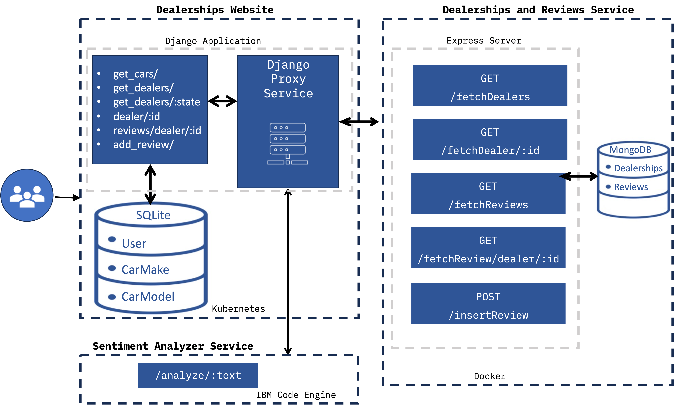

# fullstack_developer_capstone

## Architecture Overview

1. Add user management to the Django application.

   - Implement user management using the Django user authentication system and create a REACT frontend.

1. Implement backend services.

   - Create Node.js server to manage dealers and reviews using MongoDB and dockerize it.
   - Deploy sentiment analyzer on Code Engine.
   - Create Django models and views to manage car model and car make.
   - Create Django proxy services and views to integrate dealers and reviews together.

1. Add dynamic pages with Django templates.

   - Create a page that displays all the dealers.
   - Create a page that displays reviews for a selected dealer.
   - Create a page that lets the end user add a review for a selected dealer.

1. Implement CI/CD, and then run and test your application

   - Set up continuous integration and delivery for code linting.
   - Run your application on Cloud IDE.
   - Test the updated application locally.
   - Deploy the application on Kubernetes.

### Solution architecture

The solution will consist of multiple technologies

1. The user interacts with the "Dealerships Website", a Django website, through a web browser.

1. The Django application provides the following microservices for the end user:

   - get_cars/ - To get the list of cars from
   - get_dealers/ - To get the list of dealers
   - get_dealers/:state - To get dealers by state
   - dealer/:id - To get dealer by id
   - review/dealer/:id - To get reviews specific to a dealer
   - add_review/ - To post review about a dealer

1. The Django application uses SQLite database to store the Car Make and the Car Model data.

1. The "Dealerships and Reviews Service" is an Express Mongo service running in a Docker container. It provides the following services::

   - /fetchDealers - To fetch the dealers
   - /fetchDealer/:id - To fetch the dealer by id
   - fetchReviews - To fetch all the reviews
   - fetchReview/dealer/:id - To fetch reviews for a dealer by id
   - /insertReview - To insert a review

1. "Dealerships Website" interacts with the "Dealership and Reviews Service" through the "Django Proxy Service" contained within the Django Application.

1. The "Sentiment Analyzer Service" is deployed on IBM Cloud Code Engine, it provides the following service:

   - /analyze/:text - To analyze the sentiment of the text passed. It returns positive, negative or neutral.

1. The "Dealerships Website" consumes the "Sentiment Analyzer Service" to analyze the sentiments of the reviews through the Django Proxy contained within the Django application.



## Deploy Sentiment Analysis on Code Engine as a Microservice

```bash
cd xrwvm-fullstack_developer_capstone/server/djangoapp/microservices

docker build . -t us.icr.io/${SN_ICR_NAMESPACE}/senti_analyzer

docker push us.icr.io/${SN_ICR_NAMESPACE}/senti_analyzer

ibmcloud ce application create --name sentianalyzer --image us.icr.io/${SN_ICR_NAMESPACE}/senti_analyzer --registry-secret icr-secret --port 5000
```

## Add Continuous Integration and Continuous Deployment

### GitHub actions

GitHub actions provide an event-driven way to automate tasks in your project. There are several kinds of events that you've come across, such as:

- push: Runs tasks when someone pushes to a repository branch
- pull_request: Runs tasks when someone creates a pull request (PR). You can also start tasks when certain activities happen, such as:
  - PR opened
  - PR closed
  - PR reopened
- create: Run tasks when someone creates a branch or a tag
- delete: Run tasks when someone deletes a branch or a tag
- manually: Jobs are kicked off manually

GitHub action components

In this lab, you can leverage one or more GitHub action components listed below:

- **Workflows**: A collection of jobs you can add to your repository.
- **Events**: An activity that launches a workflow.
- **Jobs**: A sequence of one or more steps. Jobs are run in parallel by default.
- **Steps**: Individual tasks that can run in a job. A step may be an action or a command.
- **Actions**: The smallest block of a workflow.

### GitHub workflow

```yml
name: "Lint Code"

on:
  push:
    branches: [master, main]
  pull_request:
    branches: [master, main]

jobs:
  lint_python:
    name: Lint Python Files
    runs-on: ubuntu-latest

    steps:
      - name: Checkout Repository
        uses: actions/checkout@v3

      - name: Set up Python
        uses: actions/setup-python@v4
        with:
          python-version: 3.12

      - name: Install dependencies
        run: |
          python -m pip install --upgrade pip
          pip install flake8

      - name: Print working directory
        run: pwd

      - name: Run Linter
        run: |
          pwd
          # This command finds all Python files recursively and runs flake8 on them
          find . -name "*.py" -exec flake8 {} +
          echo "Linted all the python files successfully"

  lint_js:
    name: Lint JavaScript Files
    runs-on: ubuntu-latest

    steps:
      - name: Checkout Repository
        uses: actions/checkout@v3

      - name: Install Node.js
        uses: actions/setup-node@v3
        with:
          node-version: 14

      - name: Install JSHint
        run: npm install jshint --global

      - name: Run Linter
        run: |
          # This command finds all JavaScript files recursively and runs JSHint on them
          find ./server/database -name "*.js" -exec jshint {} +
          echo "Linted all the js files successfully"
```

- The first line names the workflow.
- The next line defines when this workflow will run. The workflow should run when developers push a change to the main branch or create a PR. These two ways are captured as below:

  - Run the below command on push to the main branch (main or master):

    ```yml
    push:
    branches: [master, main]
    ```

  - Run the below command when PR is created on main branches (main or master):

    ```yml
    pull_request:
    branches: [master, main]
    ```

- Next, define all the jobs. There are two jobs in this workflow:

  - lint_python: Linting JavaScript function
  - lint_js: Linting Python function

### GitHub jobs

Let's look at GitHub jobs:

1. lint_python

   - Set up the Python runtime for the action to run using the actions/setup-python@v4 action
   - Install all dependencies using `pip install
   - Run the linting command flake8 \*.py in all files in server directory recursively
   - Print a message saying the linting was completed successfully

1. lint_function_js
   - Set up the Node.js runtime for the action to run using the actions/setup-node@v3action
   - Install all JSHint linter npm install jshint.
   - Run the linting command on all the .js files in the database directory recursively
   - Print a message saying the linting was completed successfully

```bash
# Start by installing the GitHub CLI (gh) using the commands given below
sudo apt update
sudo apt install gh

# Authenticate GitHub CLI using command gh auth login
gh auth login

# To get the list of workflow runs for your GitHub repository run the following command from your project directory in the terminal
gh run list

# After the list of workflow runs is displayed, pick the top most run-id from the output and view its details using command below:
gh run view <run-id> --verbose
```
